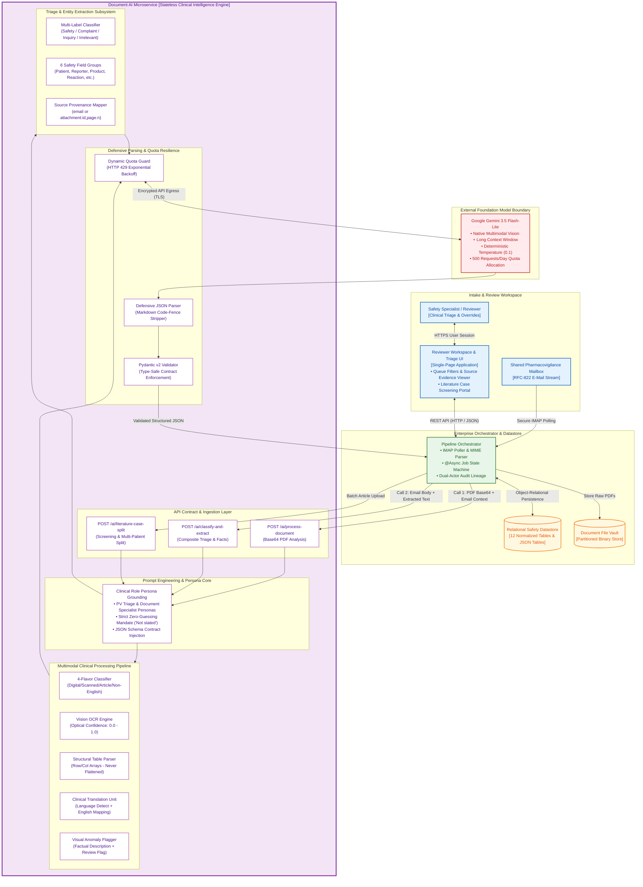
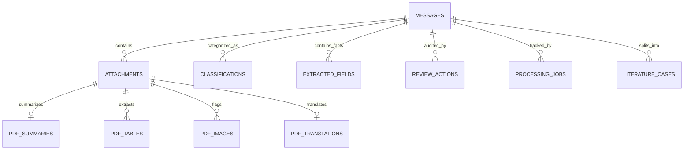

# Smart Inbox Assistant — Technical Report
## Architecture, Tech Choices, Prompting Strategy, Known Limitations, Production Roadmap

---

## 1. Architecture

The system uses a clean four-tier separation: Angular SPA → Spring Boot orchestrator → Oracle 23ai → Python/FastAPI AI microservice → Gemini API.



**Key design choice — strict 2-call orchestration per message.** Call 1 (`POST /ai/process-document`) sends the raw PDF bytes as base64 to Gemini's native vision window and returns structured text, tables, OCR confidence, translation, and a 10–15 sentence summary. Call 2 (`POST /ai/classify-and-extract`) consumes only the *text output* of Call 1 — never the raw PDF again — to classify and extract all clinical facts. For the full 13-email / 14-PDF core mailbox batch, this architecture executes exactly **27 Gemini calls** (14 × `process-document` + 13 × `classify-and-extract`). The standalone literature-screening flow (§3.5, bonus) adds one further `literature-case-split` call per uploaded article — 5 more calls across the A01–A05 test set. Full test-suite total: **32 calls, 6.4% of the 500 RPD budget-bounded ceiling.** The data model (12 normalized Oracle tables with FK cascades and `source_ref` provenance on every extracted field) and the Angular reviewer queue are purpose-built around this two-stage output.

The relational schema keeps structural concerns separate:



Every `EXTRACTED_FIELDS` row carries `source_type` + `source_ref` (e.g. `"attachment:55,page:2"`). Dual-actor audit logging writes `actor='AI'` on every model output and `actor='REVIEWER'` on every human override, forming an unbroken regulatory chain.

---

## 2. Technology Choices

| Component | Choice | Key Rationale | Trade-off |
|---|---|---|---|
| **AI Model** | Gemini 3.5 Flash-Lite | Native multimodal PDF ingestion (direct byte processing eliminates a separate OCR service), fast TTFT, and a request-budget profile well-suited to validating a consolidated 2-call-per-document architecture under a fixed daily ceiling — the prototype was deliberately built to prove correctness within a bounded quota before scaling spend | Lower zero-shot reasoning depth on complex medical nuance than flagship models; mitigated by structured prompt constraints and `temperature=0.1` determinism |
| **AI Microservice** | Python 3.12 / FastAPI | Direct `google-genai` SDK access, Pydantic v2 schema validation, rapid prompt iteration without JVM recompile cycle | Internal HTTP hop between Spring Boot and Python; negligible at prototype volumes |
| **Backend** | Java 17 / Spring Boot 3.2 | Mature MIME parsing (`jakarta.mail`), type-safe JPA/Hibernate, clean `@Transactional` boundaries, thread-safe `@Async` scheduler | More verbose than Python; justified by long-term maintainability in enterprise PV context |
| **Database** | Oracle Free 23ai | Schema parity with commercial pharma safety platforms (Oracle Argus Safety); native JSON/relational duality; check constraints for clinical enum fields | ~2 GB RAM footprint vs. PostgreSQL; acceptable for local prototype |
| **Frontend** | Angular 18 LTS + Material | Opinionated enterprise structure, native TypeScript, RxJS reactive polling for async job status | Steeper learning curve than React; justified by uniform long-term structure |
| **Task Queue** | In-process `@Async` + DB polling | No external broker dependency on developer machines; job state persists in `PROCESSING_JOBS` table | Jobs stranded if JVM terminates mid-processing; addressed in §5 |

---

## 3. Prompt Engineering & LLM Quality Strategy

Prompt design is the core intelligence layer. The guiding principle: **a wrong guess is worse than an honest gap**. Every prompt enforces this through four concrete mechanisms.

### 3.1 Clinical Persona Grounding & Role Injection

Each endpoint receives a distinct system persona that scopes what the model is allowed to infer. The document-processing prompt (`document_prompt.py`) opens:

> *"You are a document-understanding assistant for a pharmaceutical safety-monitoring inbox. You will be given the contents of a single PDF attachment plus brief email context it arrived with…"*

The classification prompt (`classify_prompt.py`) opens:

> *"You are a triage assistant for a pharmaceutical company's shared safety-monitoring inbox. You will be given an email's sender, subject, and body, plus the extracted text/tables from any PDF attachments already processed. Classify the message and extract structured facts."*

The literature screening prompt (`literature_prompt.py`) adds a critical negative constraint absent from the other two:

> *"A general review of a drug class with no individual patient described is NOT reportable."*

Persona grounding is not cosmetic — it shifts the model's prior toward conservative, citation-backed outputs rather than generative inference.

### 3.2 Zero-Guessing Mandate & Honest Uncertainty

The most critical constraint is the explicit `"Not stated"` rule, embedded verbatim in both extraction prompts:

> *"For any field not explicitly stated anywhere in the email or attachments, set its value to the literal string 'Not stated' and its confidence to null. Never infer, estimate, or default a value that is not directly supported by the text."*

This produces a three-state output system:

| State | Value | Confidence |
|---|---|---|
| Field present and clear | `"<verbatim text>"` | `0.0–1.0` |
| Field absent from document | `"Not stated"` | `null` |
| Scanned text — ambiguous read | `"<best read>"` | `0.3–0.7` + top-level `ocrConfidence` |

The `null` confidence propagates through Pydantic v2 validation to Java `null` and Oracle SQL `NULL`, so downstream audit queries can reliably surface all fields where the AI was uncertain without application-layer filtering.

For embedded images, the model is explicitly forbidden from diagnosis — it writes a factual visual description only (e.g., *"Photograph of cracked white tablet inside blister pocket"*) and sets `reviewFlag: true`.

### 3.3 Structured Output Contract & Temperature

All three endpoints use Gemini's native `response_mime_type: "application/json"` + `response_schema` parameters, passing a full JSON Schema object that mirrors the Pydantic models. This is the primary output-control mechanism.

Temperature is set to **0.1** (via `AI_TEMPERATURE` env var in `config.py`). Near-zero was chosen to suppress creative variation in field values and classification rationales. Exactly `0.0` (fully greedy decoding) was deliberately avoided because it can produce repetition loops in longer narrative extraction fields like the 10–15 sentence `summary`.

### 3.4 Defensive Parsing — Three-Tier Fallback

Despite the structured output contract, the model occasionally wraps responses in markdown code fences under high context-window pressure. The `clean_json_response` function (`classify_route.py`, `document_route.py`) applies three tiers before raising an HTTP 502:

1. **Regex code-fence stripping** — extracts content between ` ```json ... ``` ` or ` ``` ... ``` ` blocks.
2. **Direct `json.loads`** — standard parse on the stripped text.
3. **Outermost-brace fallback** — `re.search(r"(\{[\s\S]*\}|\[[\s\S]*\])", text)` isolates the outermost JSON boundary if conversational filler surrounds the payload.

In practice the native schema mode eliminated the need for tiers 1 and 3 in the majority of calls; the fallback exists for the edge cases.

### 3.5 Validation Against the Synthetic Test Set

The 13-email / 14-PDF synthetic dataset was purpose-designed so every acceptance criterion maps to a specific file (see `Docs/TEST_DATA_MANIFEST.md`). Key observations from running the full batch:

| Test Case | Result |
|---|---|
| Classification accuracy across 13 messages | **13/13 correct** primary category |
| Multi-label case (E03 — Safety Report + Quality Complaint) | Correct dual-label on first attempt, no prompt adjustment |
| Sparse safety report (E02 — no age/sex/reporter) | All 5 missing fields → `"Not stated", confidence: null`. Zero spurious inferences. |
| OCR variability — S01 (clear) vs. S02 (low legibility) | `ocrConfidence: 0.91` vs. `0.62` — genuine variation, not a placeholder constant |
| Multi-case article split (A02 — two fictional patients) | Correctly split into 2 discrete case records |
| Non-reportable article (A03 — general review, no patient) | `isReportable: false` returned correctly |
| **Known failure mode** | Narrow two-column journal layouts (ARTICLE type) occasionally produce merged reading-order text. Prompt instructs column-aware extraction but cannot guarantee correct flow on all layouts — flagged for human review. |
| Literature-screening call volume | 5 articles → 5 `literature-case-split` calls, on top of the 14 `process-document` calls already run against them as part of core PDF processing |

---

## 4. Known Limitations

### AI Model & Output Quality

| Limitation | Impact |
|---|---|
| **Uncalibrated confidence scores** | The model's self-reported `0.0–1.0` scores reflect token probability, not precision calibrated against a gold-standard dataset. Scores are directionally useful for triage prioritization but cannot be treated as statistically rigorous. |
| **Single OCR pass, no image pre-processing** | Gemini vision handles OCR natively. Severely degraded faxes or faint handwriting receive no binarization, skew correction, or contrast enhancement before inference — the model's pass is the only pass. |
| **Multi-column article parsing degradation** | Narrow journal column layouts can produce merged reading order. Addressed in the prompt but not fully eliminable at inference time. |
| **Fixed daily request ceiling** | At 2 calls/email (plus 1/article for literature screening), a production mailbox receiving 500–2,000 emails/day requires roughly 1,000–4,000+ RPD — 2–8× the prototype's evaluation ceiling. The 2-call architecture minimizes consumption per document but does not eliminate the need for a production-tier quota commensurate with real volume. |

### Infrastructure & Security (Prototype Scope)

| Limitation | Impact |
|---|---|
| **Cloud API data transit** | All clinical text and PDFs are sent to Google AI Studio. Acceptable for synthetic test data; real PHI requires a BAA and zero-data-retention policy under HIPAA §164.312 / GDPR Art. 28. |
| **Free-text reviewer identity** | `reviewerName` is an unvalidated string — no SSO, no MFA. Any user can submit decisions under any name. |
| **In-process job queue** | Spring `@Async` jobs are stranded if the JVM terminates mid-processing; no dead-letter recovery. |
| **25 MB PDF payload cap** | Large clinical dossiers (100+ page trial reports) exceed the HTTP request limit between Spring Boot and FastAPI and fail ingestion. |

---

## 5. What We'd Change for Production

Changes are ordered by deployment-blocking risk: privacy and regulatory readiness first, since real patient data cannot legally reach any external API without it; AI-quality improvements next, since they compound on top of a compliant data pipeline; infrastructure scaling last, since it can be phased in incrementally without gating go-live.

### 5.1 Privacy-Preserving AI

- **PHI de-identification before egress**: Deploy Microsoft Presidio (or equivalent) as a pre-processing sidecar to redact direct identifiers (names, dates of birth, addresses) from email bodies and PDF extracted text before content reaches the cloud API.
- **Private deployment option**: For zero-egress environments, evaluate Google Vertex AI with a BAA in place, or a self-hosted open-weight model (e.g., Llama 3 70B) fine-tuned on de-identified pharmacovigilance extraction examples.
- **Prompt-injection hardening**: Because email bodies and PDF text are externally supplied and untrusted, treat all extracted content as data, not instructions — wrap user/document content in clearly delimited blocks in every prompt, strip or flag embedded instruction-like text (e.g., "ignore previous instructions") before it reaches the model, and add a post-hoc consistency check comparing the classification confidence/reason against the literal source text before persisting. This is a distinct threat from PHI handling and should be evaluated independently of the de-identification work above.

### 5.2 AI Model & Prompt Quality

- **Model selection framework, decoupled from a single vendor**: The 2-call orchestration pattern and Pydantic schema contracts are model-agnostic by design — every prompt is schema-driven rather than model-tuned, so swapping the underlying model is a config change, not an architectural one. Before production, candidate models (across Gemini tiers and comparable multimodal offerings) would be benchmarked head-to-head on the existing synthetic test set against four criteria: (1) accuracy on the known ARTICLE multi-column failure mode identified in §3.5/§4, (2) borderline multi-label classification agreement, (3) cost and throughput at the production volume sized in §4 (1,000–4,000+ RPD), and (4) data-handling terms (BAA / zero-retention availability, see §5.1). The model stays a replaceable, evidence-selected component rather than one fixed at prototype time.
- **Empirical confidence calibration**: Run the system against a retrospectively labelled set of de-identified real cases to compute precision/recall per category and per field group. Derive a threshold table mapping raw model confidence to actionable triage priority (e.g., `≥ 0.85` → routine queue; `< 0.60` → senior specialist flag).
- **Few-shot prompt enrichment, targeted at the known failure mode**: Once reviewer overrides accumulate (~200–500 cases), inject 3–5 representative examples into each system prompt — one high-confidence clean case, one sparse `"Not stated"`-heavy case, one multi-label case, and specifically one narrow two-column ARTICLE layout that previously produced merged reading order (§3.5). Few-shot examples provide the largest per-token accuracy gains for structured extraction tasks without requiring fine-tuning, and targeting the documented failure mode directly makes this measurable via the existing eval harness.
- **Native constrained generation**: Migrate fully to Gemini's schema-constrained generation mode to eliminate the three-tier defensive parser and its latency overhead at the source.
- **Prompt regression harness**: Any system prompt change must pass an automated `eval_batch.py` run scoring classification accuracy, `"Not stated"` fidelity, and source-reference completeness before deployment. CI gates on a minimum threshold per metric.
- **OCR pre-processing pipeline**: Add a lightweight image pre-processing stage (binarization, deskew, contrast normalization — e.g., OpenCV) ahead of the vision model call for SCANNED documents, rather than relying on a single raw-image inference pass. This directly targets the "single OCR pass, no image pre-processing" limitation (§4) and is expected to reduce `ocrConfidence` variance on degraded scans independent of which model is used downstream.
- **Chunked ingestion for oversized documents**: Replace the current 25MB single-request payload cap with page-range chunking — split large PDFs (100+ page trial dossiers) into sub-batches processed as multiple `process-document` calls against the same attachment, with results merged server-side by Spring Boot before persistence. This removes the hard ingestion failure documented in §4 without requiring a raw payload-limit increase that would still eventually be hit.

### 5.3 Infrastructure & Regulatory Compliance

- **Distributed event streaming**: Replace Spring `@Async` with Apache Kafka for mailbox ingestion events — horizontal scaling, guaranteed delivery, dead-letter queue recovery for stranded jobs.
- **Cloud object storage**: Migrate local PDF storage to S3 / Azure Blob with AES-256 encryption at rest and presigned URLs for UI preview.
- **Enterprise IAM & 21 CFR Part 11**: Replace free-text `reviewerName` with OAuth2/OIDC SSO, RBAC between triage roles, and cryptographic HMAC-chained audit log entries with dual-factor electronic signatures on classification overrides per FDA 21 CFR Part 11 §11.50–§11.100.
- **Regulatory export**: ICH E2B(R3) HL7 XML serialization for direct FAERS/EudraVigilance submission; MedDRA auto-coding for adverse reaction term standardization to Preferred Terms.