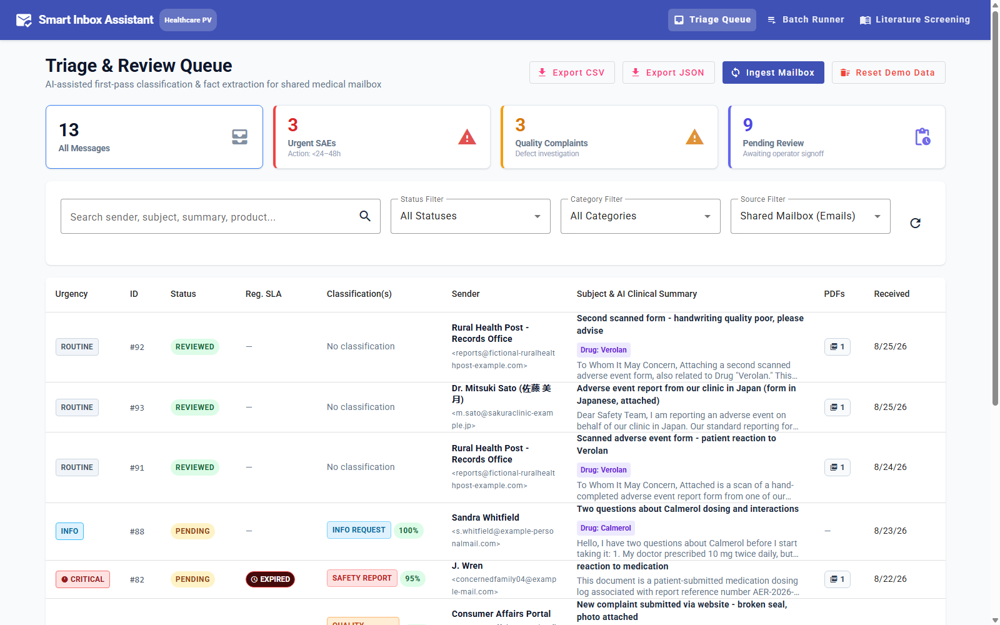
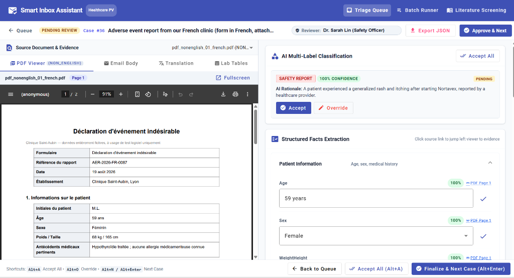
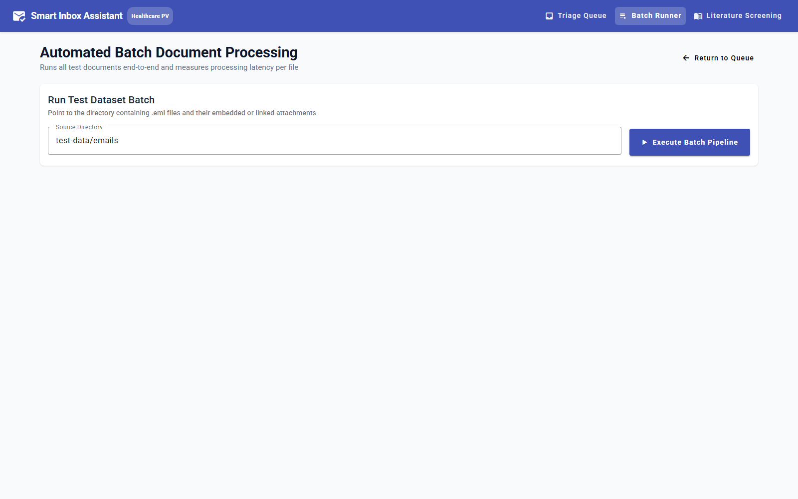
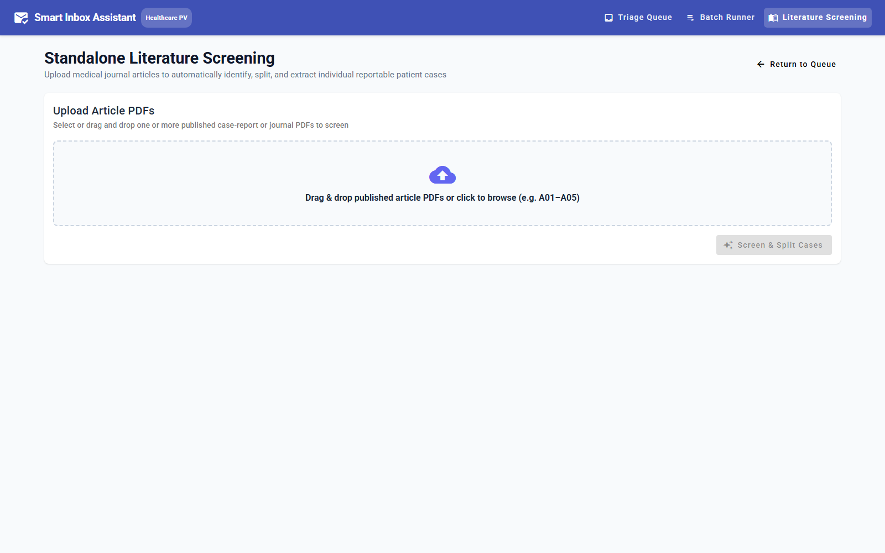
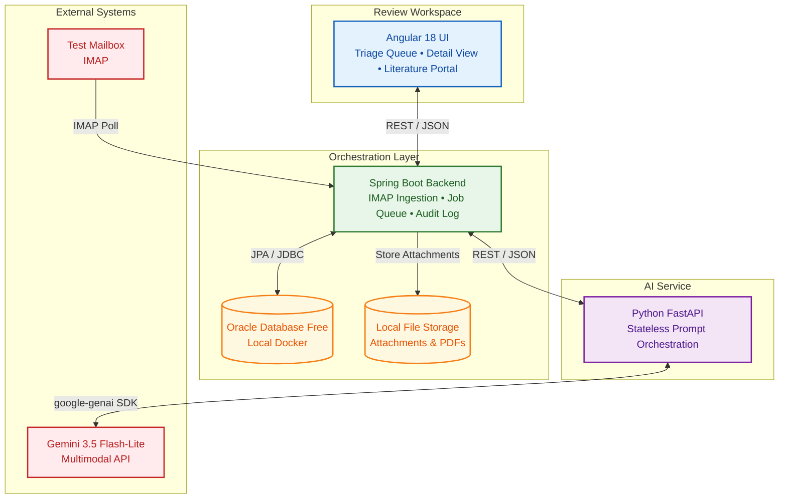

# Smart Inbox Assistant for a Healthcare Company

An AI-powered pharmaceutical safety-monitoring and inbox triaging assistant. The system ingests shared pharmacovigilance (PV) emails and PDF attachments, classifies incoming messages into **4 primary categories**, detects and analyzes **4 distinct PDF document types**, extracts structured clinical and complaint facts with confidence scores and exact source traceability, and presents them in a human-in-the-loop review interface for acceptance or override.

---

## Demo & Screenshots

### 🎬 Live Demo Walkthrough

<video src="sample-outputs/demo_walkthrough.mp4" controls width="100%">
  Your browser does not support the video tag. <a href="sample-outputs/demo_walkthrough.mp4">Download the demo video</a>.
</video>

### 📸 Application Screenshots

#### Triage & Review Queue
AI-classified inbox with confidence scores, category badges, urgency indicators, and status filters.



#### Case Detail & Review Screen
Split-pane view with embedded PDF viewer (left) and structured fact extraction with per-field confidence scores and source traceability links (right).



#### Batch Processing Runner
Automated end-to-end batch pipeline with live progress tracking and per-document latency measurement.



#### Literature Screening Portal
Bonus feature — upload article PDFs for automated patient case identification and splitting.




## Architecture Overview



### Core Separation of Responsibilities

1. **Frontend (`frontend/`)**: Angular 18 LTS with Angular Material. Triage queue with category chips and status filters, comprehensive detail review screen with inline field editing, clickable source evidence links (`attachment:id,page:num`), split PDF viewer modal, live batch progress runner, and literature screening portal.
2. **Backend (`backend/`)**: Spring Boot 3.2+ (Java 17/21). Central orchestrator for IMAP email polling, RFC-822 / MIME parsing, local file attachment storage, asynchronous job queue (`@Async` with `PROCESSING_JOBS` table), audit logging, and human reviewer action persistence.
3. **AI Service (`ai-service/`)**: Stateless Python 3.12 FastAPI microservice. Encapsulates all Gemini multimodal prompt engineering and structured JSON validation. Never touches the database directly.
4. **Database (`db/`)**: Oracle Database Free running in Docker. 11 core tables + 1 literature extension table with relational integrity, foreign key cascades, and check constraints.

---

## Key Domain Capabilities

### 1. Four Message Categories (Multi-Label Supported)
- **`SAFETY_REPORT`**: Adverse drug reactions describing patient, suspect product, reporter, and adverse outcome.
- **`QUALITY_COMPLAINT`**: Physical product defects, broken packaging, counterfeit, seal damage, contamination.
- **`INFO_REQUEST`**: General medical inquiries, dosage questions, drug interaction inquiries without adverse events.
- **`NOT_RELEVANT`**: Non-actionable emails (spam, newsletters, vendor solicitations, administrative correspondence).

### 2. Four PDF Flavors Detected
- **`DIGITAL`**: Standard digital-native documents (forms, labels, clinical schedules) with preserved label-value pairing.
- **`SCANNED`**: Optical recognition of handwritten or photocopied clinical reports with OCR confidence scores.
- **`ARTICLE`**: Published biomedical literature with two-column layout parsing.
- **`NON_ENGLISH`**: Automatic language detection and English translation preserving original page coordinates.

### 3. Data & Secrets Policy
- **Zero real patient/client/PII data**: 100% synthetic fictional data (`555` phone numbers, fictional names, synthetic batch numbers). See [Environment Variables Configuration](#environment-variables-configuration) for the secrets-handling policy.

### 4. AI Behavior Guarantees
- **Max 2 Gemini calls per document**: Exactly 1 call for PDF extraction (`POST /ai/process-document`) + exactly 1 call for message classification & fact extraction (`POST /ai/classify-and-extract`). The core mailbox batch (13 emails + 9 embedded PDFs) uses **27 calls**; the Literature Screening bonus adds 1 call per article (**5 more** for the full article set), for **32 calls total** — 6.4% of the 500 RPD budget-bounded ceiling.
- **PDF Tables**: Stored as structured rows and columns in `PDF_TABLES` (never flattened into text blobs).
- **Missing Fields**: Explicitly set to `"Not stated"` with `confidence: null` (never hallucinated or guessed).

---

## Directory Structure

```
Smart_Inbox_Assistant_for_a_Healthcare_Company/
├── docker-compose.yml              # Local Oracle Database Free Docker container definition
├── .env.example                    # Template environment variables (placeholders only)
├── .gitignore                      # Git ignore rules (protecting .env and local storage)
├── README.md                       # Main setup, execution, and verification guide
├── Documents/                      # Architecture and technical reports
│   └── TECHNICAL_REPORT.md         # Technical architecture, prompting & production roadmap
├── db/
│   └── migrations/
│       ├── V001__create_schema.sql             # 11 Core tables DDL
│       └── V002__create_literature_tables.sql  # Literature screening extension DDL
├── ai-service/                     # Python 3.12 FastAPI Microservice
│   ├── requirements.txt            # Python dependencies (fastapi, uvicorn, google-genai, etc.)
│   ├── config.py                   # GenAI client configuration & .env loader
│   ├── main.py                     # FastAPI entrypoint and /ai/health route
│   ├── models/                     # Pydantic validation schemas
│   ├── prompts/                    # Verbatim system prompts & JSON schemas
│   └── routes/                     # /process-document, /classify-and-extract, /literature-case-split
├── backend/                        # Spring Boot 3.2 Backend (Java 17/21)
│   ├── pom.xml                     # Maven project definition
│   ├── mvnw / mvnw.cmd             # Maven Wrapper scripts
│   └── src/
│       ├── main/java/com/smartinbox/
│       │   ├── config/             # Async, CORS, AppProperties configuration
│       │   ├── model/              # Enums (SourceType, Category, PdfType, etc.)
│       │   ├── entity/             # 12 JPA Entities
│       │   ├── repository/         # 12 Spring Data JPA Repositories
│       │   ├── service/            # Core business & orchestration services
│       │   ├── controller/         # REST API endpoints
│       │   └── dto/                # Request & response transfer objects
│       ├── main/resources/
│       │   └── application.yml     # Application configuration & env bindings
│       └── test/java/com/smartinbox/ # Unit & integration tests
├── frontend/                       # Angular 18 LTS + Angular Material
│   ├── package.json                # NPM dependencies and scripts
│   └── src/app/
│       ├── core/                   # Models, HTTP services, safe-url pipe
│       └── features/
│           ├── queue/              # Triage queue table with filters & category chips
│           ├── detail/             # Comprehensive review, override, and field edit UI
│           ├── batch/              # Automated batch execution runner
│           └── literature/         # Standalone article PDF screening portal
└── test-data/                      # Synthetic test dataset (13 emails, 14 PDFs)
    ├── README.md                   # Test data manifest & fidelity documentation
    ├── emails/                     # 13 RFC-822 .eml files (E01–E13), 9 PDFs embedded as MIME attachments
    └── pdfs/
        ├── digital/                # 5 normal digital PDFs
        ├── scanned/                # 2 scanned/handwritten PDFs
        ├── article/                # 5 published-article PDFs (uploaded via Literature Screening, not the mailbox)
        └── nonenglish/             # 2 non-English PDFs
```

---

## Prerequisites

Before running the application locally, ensure you have the following installed:

| Tool | Minimum Version | Verified Version | Purpose |
|------|-----------------|------------------|---------|
| **Docker & Docker Compose** | v20.10+ / Compose v2+ | Docker Desktop 4.x+ | Hosts local Oracle Database Free instance |
| **Java JDK** | 17 LTS | OpenJDK 17 or 21 | Runs Spring Boot backend |
| **Python** | 3.12+ | Python 3.12.8 | Runs FastAPI AI service |
| **Node.js & npm** | Node v18+, npm v9+ | Node v22.18+, npm v11.8+ | Runs Angular 18 frontend |
| **Google Gemini API Key** | — | — | Access to `gemini-3.5-flash-lite` model |

Verify your environment:
```bash
docker --version
java -version
python --version    # or python3 --version
node --version
npm --version
```

---

## Environment Variables Configuration

The application uses environment variables for configuration. A template file `.env.example` is provided in the project root.

> [!CAUTION]
> **Zero Real Secrets Policy**: Never commit real API keys, email passwords, or private tokens to Git. Use placeholders in configuration templates.

### 1. Create Local `.env` File

Copy the template to `.env` in the project root:

```bash
# On Windows (PowerShell) or Linux/macOS
cp .env.example .env
```

### 2. Environment Variables Reference Table

| Variable Name | Required? | Default Value | Consumed By | Description & Placeholder Example |
|---------------|-----------|---------------|-------------|-----------------------------------|
| `GEMINI_API_KEY` | **Yes** | `""` | Python AI Service | Your Google AI Studio API key. Get one at [aistudio.google.com](https://aistudio.google.com/).<br>Example: `AIzaSy...your_gemini_api_key_here` |
| `AI_MODEL_NAME` | No | `gemini-3.5-flash-lite` | Python AI Service | Gemini model variant (sole allowed model per spec). |
| `AI_TEMPERATURE` | No | `0.1` | Python AI Service | LLM sampling temperature for deterministic fact extraction. |
| `AI_SERVICE_URL` | No | `http://localhost:8000` | Spring Boot Backend | Base URL where the Python FastAPI AI service is reachable. |
| `ORACLE_HOST` | No | `localhost` | Spring Boot Backend | Hostname of the Oracle 23ai Free instance. |
| `ORACLE_PORT` | No | `1521` | Spring Boot / Docker | Listener port for Oracle Database. |
| `ORACLE_SERVICE` | No | `FREEPDB1` | Spring Boot Backend | Pluggable Database (PDB) service name. |
| `ORACLE_USER` | No | `system` | Spring Boot Backend | Oracle DB user name. |
| `ORACLE_PASSWORD` | No | `YourStrongOraclePassword123!` | Docker & Spring Boot | Password for the Oracle DB instance. |
| `STORAGE_PATH` | No | `./storage` | Spring Boot Backend | Local directory for storing ingested email attachments. |
| `SPRING_PROFILES_ACTIVE` | No | `dev` | Spring Boot Backend | Active Spring configuration profile. |
| `GMAIL_USER` | No* | `your_test_email@gmail.com` | Spring Boot Backend | Dedicated Gmail mailbox username (*only if testing live IMAP*). |
| `GMAIL_APP_PASSWORD` | No* | `your_16_char_app_password` | Spring Boot Backend | 16-character Google App Password (*only if testing live IMAP*). |
| `IMAP_HOST` | No | `imap.gmail.com` | Spring Boot Backend | IMAP server hostname. |
| `IMAP_PORT` | No | `993` | Spring Boot Backend | IMAP secure SSL port. |

*\* Note: For local testing with the synthetic test dataset (`test-data/`), you **do not** need a live Gmail account. Keep `GMAIL_USER` and `GMAIL_APP_PASSWORD` as placeholders.*

---

## How to Run Locally (Step-by-Step)

To run the complete system locally, start the 4 components in order across separate terminal tabs or windows.

```
Step 1: Oracle Database ──▶ Step 2: Python AI Service ──▶ Step 3: Spring Boot Backend ──▶ Step 4: Angular Frontend
```

---

### Step 1: Start Oracle Database Free (Docker)

Start the Oracle Database Free container in detached mode:

```bash
docker compose up -d
```

#### Wait for Container Health
Oracle Database takes approximately **60–90 seconds** on its very first launch to initialize the `FREEPDB1` pluggable database. Monitor the container status and wait until the database is ready:

```bash
# Check container status
docker compose ps

# Or follow startup logs
docker logs -f smart-inbox-oracle
```
*Look for: `DATABASE IS READY TO USE!` in the logs.*

> [!IMPORTANT]
> The Docker healthcheck may report `(unhealthy)` on some host configurations due to the `ORACLE_HOME` variable not being set on the host. The database is operational as long as `DATABASE IS READY TO USE!` appears in the logs.

#### Database Migrations (Required on First Run)
The migration SQL files in `db/migrations/` are mounted into the Oracle container but **must be executed manually** the first time the database is created. Run both migration scripts in order:

**On Windows (PowerShell):**
```powershell
Get-Content db/migrations/V001__create_schema.sql | docker exec -i smart-inbox-oracle sqlplus system/$env:ORACLE_PASSWORD@localhost:1521/FREEPDB1
Get-Content db/migrations/V002__create_literature_tables.sql | docker exec -i smart-inbox-oracle sqlplus system/$env:ORACLE_PASSWORD@localhost:1521/FREEPDB1
```

**On macOS / Linux (Bash):**
```bash
docker exec -i smart-inbox-oracle sqlplus system/"$ORACLE_PASSWORD"@localhost:1521/FREEPDB1 < db/migrations/V001__create_schema.sql
docker exec -i smart-inbox-oracle sqlplus system/"$ORACLE_PASSWORD"@localhost:1521/FREEPDB1 < db/migrations/V002__create_literature_tables.sql
```

> [!CAUTION]
> If you skip this step, the Spring Boot backend will fail on startup with `ORA-00942: table or view does not exist`. The migrations only need to be run once — the tables persist across container restarts via the `oracle-data` Docker volume.

---

### Step 2: Start Python FastAPI AI Service

Open a **new terminal window** and navigate to `ai-service`:

#### On Windows (PowerShell):
```powershell
cd ai-service

# 1. Create Python virtual environment
python -m venv .venv

# 2. Activate virtual environment
# (If execution policy error occurs, run: Set-ExecutionPolicy -Scope Process -ExecutionPolicy Bypass)
.\.venv\Scripts\activate

# 3. Install dependencies
pip install -r requirements.txt

# 4. Start FastAPI server with live-reload
uvicorn main:app --host 0.0.0.0 --port 8000 --reload
```

#### On macOS / Linux (Bash):
```bash
cd ai-service

# 1. Create Python virtual environment
python3 -m venv .venv

# 2. Activate virtual environment
source .venv/bin/activate

# 3. Install dependencies
pip install -r requirements.txt

# 4. Start FastAPI server with live-reload
uvicorn main:app --host 0.0.0.0 --port 8000 --reload
```

#### Verify AI Service Health:
```bash
curl http://localhost:8000/ai/health
```
Expected response:
```json
{
  "status": "ok",
  "service": "ai-service",
  "model": "gemini-3.5-flash-lite",
  "apiKeyConfigured": true
}
```

---

### Step 3: Start Spring Boot Backend

Open a **new terminal window** and navigate to `backend`:

#### On Windows (PowerShell / Command Prompt):
```powershell
cd backend

# Run with Maven Wrapper
.\mvnw.cmd spring-boot:run
```

#### On macOS / Linux (Bash):
```bash
cd backend

# Ensure execute permissions on wrapper
chmod +x mvnw

# Run with Maven Wrapper
./mvnw spring-boot:run
```

The Spring Boot backend will start on **`http://localhost:8080`**.

#### Verify Backend Health:
```bash
curl http://localhost:8080/api/messages
```
Expected response (on initial fresh database):
```json
{"items":[],"total":0}
```
*(Once the core mailbox batch is executed, this endpoint returns `{"items":[...],"total":13}`. Running the Literature Screening bonus afterward adds one row per identified case, so `total` will grow beyond 13.)*

---

### Step 4: Start Angular 18 Frontend

Open a **new terminal window** and navigate to `frontend`:

```bash
cd frontend

# 1. Install Node dependencies
npm install

# 2. Start Angular dev server
npm start
```

The Angular application will compile and become available at **`http://localhost:4200`**.

---

## Local Service & Health Check Matrix

| Component | Host / Port | Health Check / Test Endpoint | Expected Status |
|-----------|-------------|------------------------------|-----------------|
| **Oracle Database 23ai** | `localhost:1521` | `docker compose ps` | `Up (healthy)` |
| **Python AI Service** | `http://localhost:8000` | `GET http://localhost:8000/ai/health` | HTTP 200, `status: "ok"` |
| **Spring Boot Backend** | `http://localhost:8080` | `GET http://localhost:8080/api/messages` | HTTP 200, `items: []` |
| **Angular 18 UI** | `http://localhost:4200` | Browser visit to `http://localhost:4200` | HTTP 200, Queue page rendered |

---

## Testing & Verification Walkthrough

### 1. Run Automated Unit & Integration Tests

Run the Spring Boot Maven test suite verifying MIME parsing, review accept/override logic, and 2-call orchestration:
```bash
cd backend
# Windows:
.\mvnw.cmd test
# macOS/Linux:
./mvnw test
```
*All tests run with 0 errors and 0 failures.*

---

### 2. Execute Automated Batch Ingestion (Synthetic Test Dataset)

The repository includes 13 synthetic RFC-822 `.eml` emails and 14 PDFs in `test-data/`. You can ingest and process the entire dataset in two ways:

#### Option A: Via Web UI (Recommended)
1. Open your browser to `http://localhost:4200/batch`.
2. Ensure the source directory path is set to: `test-data/emails`.
3. Click **Execute Batch Pipeline**.
4. Observe the live polling progress bar and the per-document processing duration (`duration_ms`) updating in real-time.
5. All 13 emails and their 9 embedded PDF attachments (digital, scanned, non-English) are processed automatically. The 5 published-article PDFs are screened separately through the Literature Screening flow — see Step 4 below.

#### Option B: Via cURL Command Line
```bash
curl -X POST http://localhost:8080/api/batch/run \
     -H "Content-Type: application/json" \
     -d "{\"sourceDir\": \"test-data/emails\"}"
```
Returns a `batchId` (e.g. `batch-20260906-...`). Poll status at:
```bash
curl http://localhost:8080/api/batch/{batchId}/status
```

---

### 2b. Live Mailbox Ingestion (Optional)

If `GMAIL_USER` / `GMAIL_APP_PASSWORD` are configured with a real test mailbox, you can exercise the live IMAP path instead of (or alongside) the file-based batch runner:

```bash
curl -X POST http://localhost:8080/api/mail/ingest
```

This polls the configured mailbox, retrieves any new messages, and separates PDF attachments from other attachment types. Re-running this command is safe — ingestion dedupes on the email's `Message-ID`, so already-ingested mail is never duplicated in the queue.

---

### 3. Traceability & Human Review Walkthrough

Once batch processing completes:
1. Navigate to **Triage Queue** (`http://localhost:4200/messages`).
   - Notice the category badges (`SAFETY_REPORT`, `QUALITY_COMPLAINT`, `INFO_REQUEST`, `NOT_RELEVANT`) and AI confidence scores.
   - Filter by status (`PENDING_REVIEW`, `REVIEWED`), KPI cards (Urgent SAEs, Quality Complaints, Pending Review), or category.
2. Click any message to open the **Detail View**:
   - **AI Classification**: Inspect the rationale. Click **Accept** or click **Override** to select a new category with reviewer name.
   - **Structured Facts**: Verify the 6 Safety Report field groups (Reporter, Patient, Suspect Product, Adverse Event, Concomitant Meds, Lab Tests).
   - **Honesty Check**: Notice unmentioned fields display `"Not stated"` in muted italic styling without hallucinated values.
   - **Source Evidence**: Click any blue source chip (e.g., `attachment:55,page:1`) to display the PDF previewer modal scrolled directly to the cited page.
   - **Inline Editing**: Click the pencil icon on any extracted value, edit it, and click the checkmark to save.
   - **Audit Trail**: Scroll to the bottom to verify the append-only chronological log of all AI decisions and reviewer overrides.

---

### 4. Bonus: Literature Screening

1. Open `http://localhost:4200/literature`.
2. Select one or more article PDFs from `test-data/pdfs/article/` (e.g. `article_02_multi_case.pdf`).
3. Click **Screen & Split Cases**.
4. The system:
   - Processes the document via `POST /ai/process-document`.
   - Calls `POST /ai/literature-case-split` to identify individual patient cases.
   - Routes each split case into the standard review queue, preserving complete UI and workflow reuse.

---

## Troubleshooting & Common Questions

### 1. Spring Boot fails to connect to Oracle on startup
- **Cause**: Oracle Database Free is still initializing `FREEPDB1` (takes ~60–90 seconds on first run), or the database migrations have not been applied yet.
- **Fix**: Check `docker logs -f smart-inbox-oracle` for `DATABASE IS READY TO USE!`. Ensure you have run both migration scripts from [Step 1](#step-1-start-oracle-database-free-docker). Once the database is ready and migrations are applied, re-run `.\mvnw.cmd spring-boot:run`.

### 2. PowerShell execution policy error when activating `.venv`
- **Cause**: Windows PowerShell restricts execution of local scripts by default.
- **Fix**: Run `Set-ExecutionPolicy -Scope Process -ExecutionPolicy Bypass` in your PowerShell window, then retry `.\.venv\Scripts\activate`.

### 3. Port Conflicts (8080, 8000, 4200, 1521)
- Verify no existing services are using these ports:
  - Oracle DB: `1521` (check with `netstat -ano | findstr 1521`)
  - Spring Boot: `8080` (can be changed in `application.yml` via `server.port`)
  - FastAPI: `8000` (can be changed in `uvicorn` command via `--port`)
  - Angular: `4200` (can be changed via `ng serve --port 4201`)

### 4. Gemini Rate Limit (429 RESOURCE_EXHAUSTED)
- The Python AI service includes automatic exponential retry with backoff in `call_gemini_with_retry`.
- A full run of the mailbox batch plus the Literature Screening bonus executes **32 Gemini calls** total, comfortably inside the 500 Requests/Day quota the pipeline was designed against.

---

## License & Compliance

Developed as a local-only prototype for Healthcare Pharmacovigilance Inbox Automation. **All test data is 100% synthetic**. No real patient, clinical, or client PII data is processed or stored.
